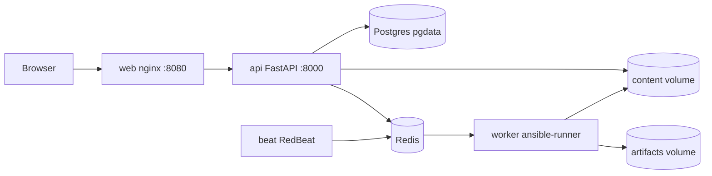

# Ansible WebGUI

Web control plane for running Ansible playbooks with git-pinned execution, RBAC, two-person approval, and live log streaming.

License: Apache-2.0 | Python: >=3.12 | React: 18.3.1

## Features

- Live runs execute an exported `git archive <git_sha>`, not mutable working trees.
- Two-person approval blocks live self-approval with `approved_by != requested_by`.
- Credentials are Fernet-encrypted at rest and materialized only in an ephemeral `0700` task directory.
- Live logs stream over SSE with replay by event counter.
- RBAC spans five roles: admin, manager, developer, operator, viewer.
- In-app git content editing includes history, diff, and revert flows.

## Architecture at a glance

| Name | Image/command | Purpose |
| --- | --- | --- |
| postgres | `postgres:16-alpine` | PostgreSQL 16 relational store, persisted in `pgdata`. |
| redis | `redis:7-alpine` | Redis 7 broker and pub/sub bus. |
| api | `Containerfile.backend`; `pg_isready` wait, `alembic upgrade head`, `uvicorn app.main:app --host 0.0.0.0 --port 8000` | FastAPI REST, SSE, startup seed, migrations; publishes on `8000:8000`. |
| worker | `celery -A app.tasks.worker worker --loglevel=info -c 4` | Runs `ansible-runner`; decrypts credentials only for task lifetime. |
| beat | `celery -A app.tasks.worker beat -S redbeat.RedBeatScheduler --loglevel=info` | RedBeat scheduler for cron-like jobs. |
| web | `Containerfile.web`; nginx | Serves React SPA and proxies `/api`; publishes `8080:80`. |



See [docs/architecture.md](docs/architecture.md).

## Quick start (operator)

```sh
cp .env.example .env      # then edit: set JWT_SECRET, FERNET_KEY, POSTGRES_PASSWORD, BOOTSTRAP_ADMIN_PASSWORD
podman compose up -d --build
```

Open the UI at `http://localhost:8080`, API docs at `http://localhost:8000/api/docs`, and health at `http://localhost:8000/api/health`. First login uses `BOOTSTRAP_ADMIN_USER` and `BOOTSTRAP_ADMIN_PASSWORD`, seeded on every `api` boot by `seed_roles_and_admin()`; change it immediately. Use `podman compose`, not `docker compose`.

Generate a Fernet key:

```sh
python -c "from cryptography.fernet import Fernet; print(Fernet.generate_key().decode())"
```

## Configuration

| Name | Default |
| --- | --- |
| `POSTGRES_HOST` | `postgres` |
| `POSTGRES_PORT` | `5432` |
| `POSTGRES_DB` | `ansible_webgui` |
| `POSTGRES_USER` | `ansible` |
| `POSTGRES_PASSWORD` | `change-me` |
| `REDIS_URL` | `redis://redis:6379/0` |
| `JWT_SECRET` | `change-me` |
| `FERNET_KEY` | `change-me` |
| `BOOTSTRAP_ADMIN_USER` | `admin` |
| `BOOTSTRAP_ADMIN_PASSWORD` | `change-me` |
| `COOKIE_SECURE` | `false` |
| `CONTENT_ROOT` | `/data/content` |
| `ARTIFACT_ROOT` | `/data/artifacts` |

See [docs/configuration.md](docs/configuration.md).

## Roles & permissions

| Role | user.manage | credential.write | content.write | job.request | job.run_check | job.approve | job.cancel | schedule.write | read |
| --- | --- | --- | --- | --- | --- | --- | --- | --- | --- |
| admin | yes | yes | yes | yes | yes | yes | yes | yes | yes |
| manager |  |  |  | yes | yes | yes | yes | yes | yes |
| developer |  |  | yes | yes | yes |  |  |  | yes |
| operator |  |  |  | yes | yes |  | yes |  | yes |
| viewer |  |  |  |  |  |  |  |  | yes |

See [docs/architecture.md#rbac](docs/architecture.md#rbac).

## Development

Frontend:

```sh
cd frontend
npm ci
npm run dev          # Vite :3000, proxies /api to localhost:8000
npx tsc --noEmit
npm run build
```

Backend tests and migrations:

```sh
podman compose exec api pytest -q
podman compose exec api alembic upgrade head
podman compose exec api alembic revision --autogenerate -m "add x"
```

Only npm scripts are `dev`, `build`, and `preview`; there is no lint or test script. Host `uv pip install --system -e '.[dev]'` fails on Ubuntu's externally-managed Python; work in the container or a dedicated venv.

## Project status

- Frontend is a scaffold: `src/main.tsx`, `src/App.tsx`, and `src/lib/api.ts`; Tailwind, router, and react-query are installed but unwired.
- `backend/app/tasks/prune.py::prune_old_data()` is a `pass` stub.
- No CI, no linter, no frontend tests.
- `.gitignore` is intentionally minimal.

## Documentation index

- [Architecture](docs/architecture.md)
- [Configuration](docs/configuration.md)
- [Deployment](docs/deployment.md)
- [API](docs/api.md)
- [Contributing](CONTRIBUTING.md)
- [Security](SECURITY.md)
- [AGENTS.md](AGENTS.md) — AI-assistant/deep contributor brief

## License

Apache-2.0. See [LICENSE](LICENSE).
