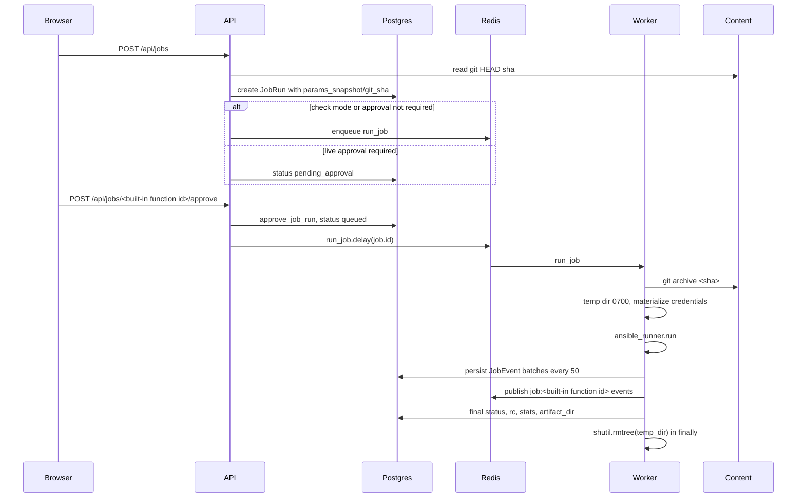

# Architecture

## Service topology

| Name | Image/command | Purpose |
| --- | --- | --- |
| postgres | `postgres:16-alpine` | PostgreSQL store, volume `pgdata`. |
| redis | `redis:7-alpine` | Celery broker and SSE pub/sub bus. |
| api | `Containerfile.backend`; wait for Postgres, run Alembic, start Uvicorn | REST, SSE, startup seed, migrations. |
| worker | `celery -A app.tasks.worker worker --loglevel=info -c 4` | Runs `ansible-runner`; decrypts credentials. |
| beat | `celery -A app.tasks.worker beat -S redbeat.RedBeatScheduler --loglevel=info` | Schedules jobs through RedBeat. |
| web | `Containerfile.web`; nginx | Serves SPA on `8080:80` and proxies `/api`. |

Shared volumes:

- `pgdata` — Postgres data, written by `postgres`.
- `content` — git source of truth for playbooks, inventories, and roles; mounted by `api`, `worker`, and `beat`.
- `artifacts` — runner artifacts and ephemeral run directories; mounted by `api`, `worker`, and `beat`.
- `sshdata` — runner `~/.ssh`; mounted by `api` and `worker`.

Compose quirk: `api`, `worker`, and `beat` use plain `depends_on`. `postgres` and `redis` define healthchecks, but those healthchecks are not consumed through `condition: service_healthy`. `api` self-waits with the inline `pg_isready` loop before running `alembic upgrade head`.

## Request path

Browser traffic reaches nginx from `web` (`nginx.conf`), which serves the SPA and proxies `/api` to FastAPI. FastAPI reads and writes Postgres and uses Redis for Celery and job-event pub/sub.

## Job lifecycle

1. `POST /api/jobs` resolves playbook, inventory, and project, reads the project HEAD SHA, rejects `template_busy`, freezes params, and sets `pending_approval` or `queued`.
2. Approval calls `approve_job_run()`, sets `queued`, and dispatches Celery `run_job`.
3. `run_job` creates a `0700` temp dir, exports `git archive <sha>` into `project`, symlinks optional `galaxy_roles` and `collections`, decrypts credentials, and runs `ansible_runner.run`.
4. The event handler stores `JobEvent` rows in batches of 50 and publishes JSON to Redis channel `job:{id}`.
5. Cancellation sets Redis key `job:{id}:cancel=1`; queued tasks are revoked.
6. Final status is derived from cancellation or runner status, then temp data is removed in `finally`.

## SSE contract

`GET /api/jobs/{job_id}/events/stream?after_counter=N` replays `JobEvent` rows with `counter > after_counter`, then subscribes to Redis channel `job:{id}`. It returns `text/event-stream`, sends `: heartbeat` after 15 seconds of pubsub idle, and closes on client disconnect.

## Caps

- Events after `event_counter > 200000` are dropped.
- `stdout` is truncated at 65536 chars with `"\n...[truncated]"`.
- List endpoints clamp `limit` to `min(limit, 200)`.

## Data model

Models: `User`, `Role`, `Project`, `Inventory`, `Credential`, `Playbook`, `JobTemplate`, `JobRun`, `JobEvent`, `Schedule`, `Commit`, `AuditLog`, plus `user_roles`.

Enums: `InventoryFormat`, `CredentialKind`, `JobMode`, `JobStatus`.

## RBAC

| Role | user.manage | credential.write | content.write | job.request | job.run_check | job.approve | job.cancel | schedule.write | read |
| --- | --- | --- | --- | --- | --- | --- | --- | --- | --- |
| admin | yes | yes | yes | yes | yes | yes | yes | yes | yes |
| manager |  |  |  | yes | yes | yes | yes | yes | yes |
| developer |  |  | yes | yes | yes |  |  |  | yes |
| operator |  |  |  | yes | yes |  | yes |  | yes |
| viewer |  |  |  |  |  |  |  |  | yes |

`require(perm)` checks the current user permissions and also enforces CSRF through `require_csrf()`.

## Scheduling

Schedules use RedBeat entries keyed `redbeat:job:<name>`, stored on `Schedule.redbeat_key`.

## Audit

Mutating endpoints write through `audit()`. Existing actions include `job_requested`, `job_approved`, `job_rejected`, and `job_canceled`.
