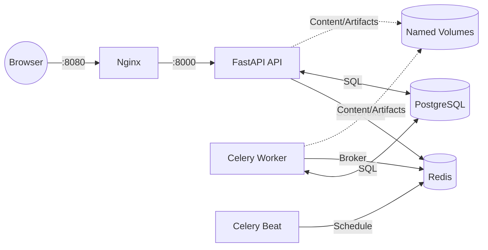

# Architecture

## Runtime Topology

Ansible WebGUI is a multi-container stack orchestrated via `podman compose`.



*   **web**: Nginx proxy serving built frontend assets and proxying API calls to the backend.
*   **api**: FastAPI application; entry point for the browser.
*   **worker**: Celery worker executing Ansible playbooks.
*   **beat**: Celery Beat scheduler for recurring tasks.
*   **postgres**: Database for state and audit logs.
*   **redis**: Celery broker and SSE pub/sub channel for real-time log streaming.

## Request Path

1.  **Browser to API**: The browser calls the Nginx proxy on `:8080`, which forwards API requests to FastAPI on `:8000`. Authentication uses HttpOnly JWT cookies.
2.  **CSRF Protection**: Mutating requests (POST, PUT, DELETE) must carry the `X-Requested-With: XMLHttpRequest` header.
3.  **Error Handling**: The API wraps all errors in an envelope defined in `app/main.py`:
    ```json
    {"detail": {"code": "...", "message": "..."}}
    ```
4.  **Frontend Calls**: All frontend API calls are funneled through `apiFetch<T>()` defined in `frontend/src/lib/api.ts`.

## Job Lifecycle

A job execution follows this path:

1.  **Resolution**: The `resolve_launch()` service (`app/services/launch.py`) processes the template, merges request-level overrides, and validates against per-field `ask_*` gating.
2.  **Approval**: If the run is a "live run" (mode is not `check`), it starts in the `pending_approval` state. An authorized user (with `job.approve` project role) executes the approval via `app/services/approvals.py`, transitioning the job to `queued`.
3.  **Execution**: The Celery worker picks up the `queued` task. `app/tasks/run_job.py` performs the following steps:
    *   Sets state to `running`.
    *   Materializes the environment: clones the repo via `git archive` (`app/tasks/job_workspace.py`), extracts inventory, and decrypts credentials into a temporary 0700-mode directory (`materialize_credentials`).
    *   Executes `ansible-runner`.
4.  **Completion**: Upon terminal events, the job transitions to one of the following terminal states: `successful`, `failed`, `canceled`, or `timed_out`. Note that `rejected` is the state when an approval is declined, and `approved` is the intermediate state before queuing.

## Authorization

Authorization is enforced at two levels:

*   **Global Permissions**: Based on global roles (`admin`, `user`, `auditor`).
*   **Project Permissions**: Enforced via `assert_project_perm()` at project-scope endpoints.

The following RBAC permissions are used:

### Global Permissions
| Role | Permissions |
| :--- | :--- |
| `admin` | `system.admin`, `user.manage`, `audit.read`, `notification.write`, `project.create`, `read` |
| `user` | `project.create`, `read` |
| `auditor` | `audit.read`, `read` |

### Project Permissions
| Role | Permissions |
| :--- | :--- |
| `owner` | `project.admin`, `credential.write`, `content.write`, `job.request`, `job.run_check`, `job.approve`, `job.cancel`, `schedule.write`, `pipeline.write`, `read` |
| `maintainer` | `credential.write`, `content.write`, `job.request`, `job.run_check`, `job.approve`, `job.cancel`, `schedule.write`, `pipeline.write`, `read` |
| `developer` | `content.write`, `job.request`, `job.run_check`, `read` |
| `operator` | `job.request`, `job.run_check`, `job.cancel`, `read` |
| `viewer` | `read` |

All mutating endpoints call `audit()` (`app/services/audit.py`) to log actions.

## Persistence and State

*   **Models**: Defined in `app/db/models.py`. The database schema is generated at startup; there are no migration scripts — schema changes require `podman compose down -v` to reset.
*   **Sessions**: The API uses `AsyncSessionLocal` (`app/db/session.py`), while Celery tasks utilize sync sessions for compatibility with `ansible-runner`.
*   **Storage**: Git-backed content resides under `CONTENT_ROOT`, while runner artifacts are saved to `ARTIFACT_ROOT`.

For the security model, please refer to `SECURITY.md`.
